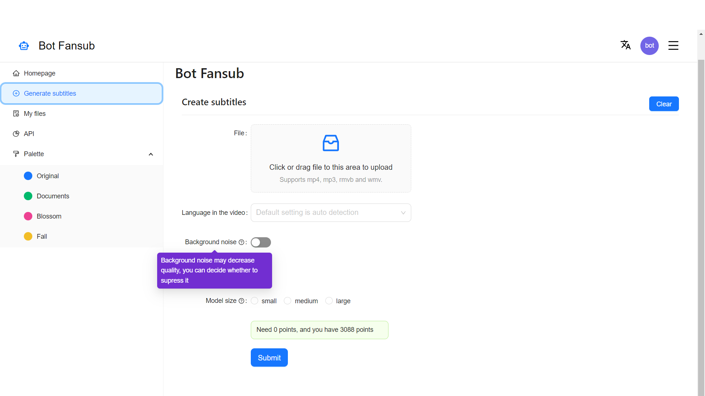
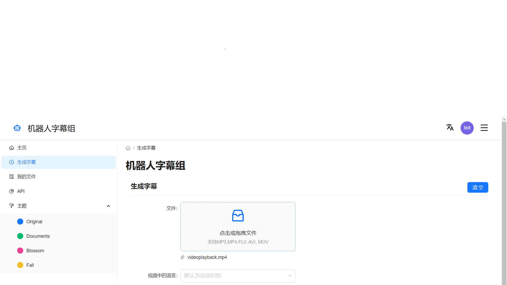

<a name="readme-top"></a>

<!-- PROJECT LOGO -->
<br />
<div align="center"> 
    
  <h3 align="center">Subtitling Bot 
  </h3>
  <h3 align="center">
      机器人字幕组
  </h3>
  <p align="center">
        An ai tool to auto translating&subtitling your videos!
       <br />
        最好的支持四十种语言的在线字幕生成翻译工具
    <br />
    <a href="https://botfansub.tech"><strong>Explore the web »</strong></a>
        <a href="https://botfansub.tech/zh"><strong>中文版 »</strong></a>
    <br />
    <br />
  </p>
</div>

<!-- ABOUT THE PROJECT -->

## About The Project

<a href="https://botfansub.tech"> 
 
</a>
<br />

<a href="https://botfansub.tech/zh"> 
 
</a>

<br />
<br />
<br />
 * An one-click tool for generating and translating subtitles, similar to the automatic translation functions of video websites like YouTube and Bilibili. This repository is for uploading an offline, real-time version in the future. Pipeline: Speech to text -> Whole translation -> Timing adjustment -> Sentence by sentence translation for missing sentences -> Generating subtitles (srt file).

<br />

<br />
 * 一个一键式生成并翻译字幕的工具，功能类似Youtube，Bilibili等视频网站的自动翻译功能，这个仓库用来上传正在开发中的离线式实时视频翻译工具。Pipeline: 语音转文字 -> 整体翻译 -> 时间校对 -> 缺失语句逐句翻译 -> 生成字幕（srt文件）


<!--Features -->
## Features

* Supports translation and recognition of over forty languages, we perform particularly well in niche languages!
* No need to install, generates online, without the hassle of environment configuration.
* Supports multiple models, free to choose between computing power and performance.

<br />

* 支持超四十种语言的翻译及识别，我们在小众语言表现尤其出色！
* 无需安装，在线生成，没有环境配置的烦恼.
* 支持多种模型，在算力和效果之间自由选择.

<!-- USAGE EXAMPLES -->
## Usage

### Web

We have a very good UI for web users, just follow the website, when you get the generated srt files, you have three options:

* You can use the srt file with video websites like Youtube, BiliBili...
* Use with media player like Windows Media Player, VLC Media Player, choose subtitles->your srt file.
* Want a video with embeded subtitles? instructions:

<br />

我们为网页用户提供了非常好的用户界面，只需按照网站操作，当你获得生成的srt文件后，你有三种选择：

* 你可以将srt文件用于Youtube，BiliBili等视频网站
* 可以在Windows Media Player，VLC Media Player等媒体播放器中使用，选择字幕->你的srt文件。
* 想要一个内嵌字幕的视频？操作指南：

### Use Ffmpeg:
1. Ffmpeg installation: <a href="https://ffmpeg.org"><strong>https://ffmpeg.org/</strong></a>
2. Use this command:
  ```sh
   ffmpeg -i input.mp4 -vf "subtitles=input.srt" output.mp4
  ```    
### Use web service

You can just google "embeded srt to video"

### Use pure python solution

This is not the best solution, you can use it when you have trouble installing Ffmpeg.
1. Clone this repository:
```sh
   git clone https://github.com/BotFunsub/Subtitling-Bot.git
 ```
2. CD to Subtitling-Bot/script
```sh
   cd Subtitling-Bot/script
```
3. Install dependency
```sh
   pip install -r requirements.txt
```
4. Run script
```sh
   python embed_srt.py -v input.mp4 -s input.srt -o output.mp4
```
### Why don't we offer to download videos with embedded generated subtitles?

Currently, this is a free tool, and we can't afford a server or cloud service to store hundreds of videos for a long period of time.
<br />
当前我们无法负担租用服务器或购买云服务用以存储数百个视频的费用

<!-- LICENSE -->
## License

Distributed under the MIT License. See `LICENSE.txt` for more information.


<!-- CONTACT -->
## Contact

Botfansub team - [@your_twitter](https://twitter.com/Botfansub) - botfansub@gmail.com

<p align="right">(<a href="#readme-top">back to top</a>)</p>


